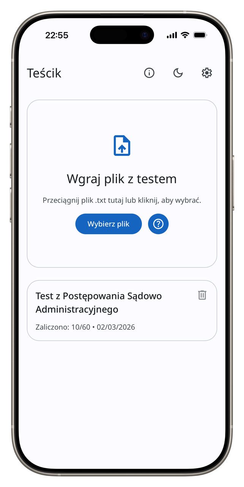
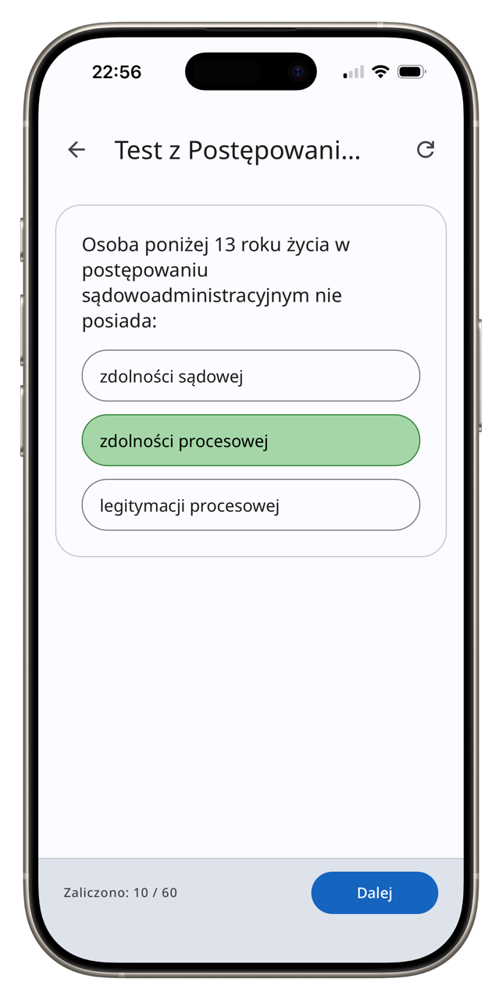

# Teścik – Twoje Centrum Nauki 🎓

*English version below.*

**Teścik** to lekka, nowoczesna i w pełni prywatna aplikacja webowa typu PWA, która pozwala na tworzenie, importowanie i rozwiązywanie testów bezpośrednio w przeglądarce. Zaprojektowana z myślą o efektywnej nauce, oferuje inteligentne powtórki i pełną kontrolę nad procesem sprawdzania wiedzy.

---

## 📸 Screenshoty / Screenshots

<p align="center">
  
  
</p>

---

## 🌟 Główne Funkcje

- **Tryb Egzaminu**: Symulacja prawdziwego testu bez podpowiedzi – wynik zobaczysz dopiero na końcu.
- **Inteligentne Powtórki**: System automatycznie pozwala skupić się na pytaniach, na które udzielono błędnej odpowiedzi.
- **Pełna Prywatność**: Aplikacja działa w 100% offline. Twoje dane i pliki nigdy nie opuszczają przeglądarki.
- **Personalizacja**:
    - Tryb ciemny oraz specjalny tryb **AMOLED** (czyste czarne tło).
    - Mieszanie pytań i odpowiedzi.
    - Automatyczne przechodzenie do następnego pytania.
- **Wygoda**: Obsługa skrótów klawiszowych (cyfry 1-9 do wyboru odpowiedzi, Enter/Spacja do zatwierdzania).
- **Kopie Zapasowe**: Łatwy import i eksport wszystkich testów do pliku JSON.
- **PWA (Progressive Web App)**: Możliwość instalacji na telefonie lub komputerze jak natywnej aplikacji.

## 🛠️ Technologie

- **Vanilla JavaScript**: Czysty kod bez ciężkich frameworków.
- **HTML5 & CSS3**: Nowoczesny układ oparty na **Material Design 3**.
- **Local Storage API**: Przechowywanie danych lokalnie w przeglądarce.
- **Service Workers**: Wsparcie dla trybu offline i instalacji PWA.

## 📝 Jak przygotować test?

Przygotuj zwykły plik tekstowy (`.txt`) w poniższym formacie:

```text
$ Tytuł Twojego Testu
? Pierwsze pytanie?
- Błędna odpowiedź
+ Poprawna odpowiedź
- Inna błędna odpowiedź

? Drugie pytanie?
+ Prawda
- Fałsz
```

Następnie po prostu przeciągnij plik do aplikacji!

## ⌨️ Skróty Klawiszowe

- `1` - `9`: Wybór odpowiedzi
- `Enter` / `Spacja`: Zatwierdzenie / Następne pytanie
- `R`: Restart quizu (w widoku wyników)
- `Esc`: Powrót do menu głównego

---

# Teścik – Your Personal Learning Center 🎓

**Teścik** is a lightweight, modern, and privacy-focused PWA web application designed to help you create, import, and solve quizzes directly in your browser. It streamlines your learning process with smart review features and total control over your data.

## 🌟 Key Features

- **Exam Mode**: Simulate real-world testing conditions by hiding immediate feedback until the very end.
- **Smart Review System**: Automatically focus on questions you find challenging or answer incorrectly.
- **100% Privacy & Offline Support**: Your data never leaves your device. Works seamlessly without an internet connection.
- **Total Customization**:
    - Dark Mode and **AMOLED Black Mode** (pure black for OLED screens).
    - Shuffle questions and answers for a fresh experience every time.
    - Auto-skip to the next question upon correct answers.
- **Enhanced Productivity**: Fast navigation via intuitive keyboard shortcuts.
- **Data Portability**: Easily export and import your entire quiz library as JSON backups.
- **PWA Ready**: Install it as a native app on iOS, Android, or Desktop.

## 🛠️ Technology Stack

- **Vanilla JavaScript**: Zero dependencies for maximum performance and longevity.
- **HTML5 & CSS3**: Responsive layout built on **Material Design 3** principles.
- **Modern Web APIs**: Leveraging **Local Storage** for data persistence and **Service Workers** for offline capability.

## 📝 Preparing Your Tests

Create a simple `.txt` file using the following syntax:

```text
$ Quiz Title
? What is the capital of France?
- Berlin
+ Paris
- London
```

Simply drag and drop the file into the app to start learning!

## ⌨️ Keyboard Shortcuts

- `1` - `9`: Select an answer
- `Enter` / `Space`: Confirm selection / Next question
- `R`: Restart quiz (on results screen)
- `Esc`: Return to main menu
